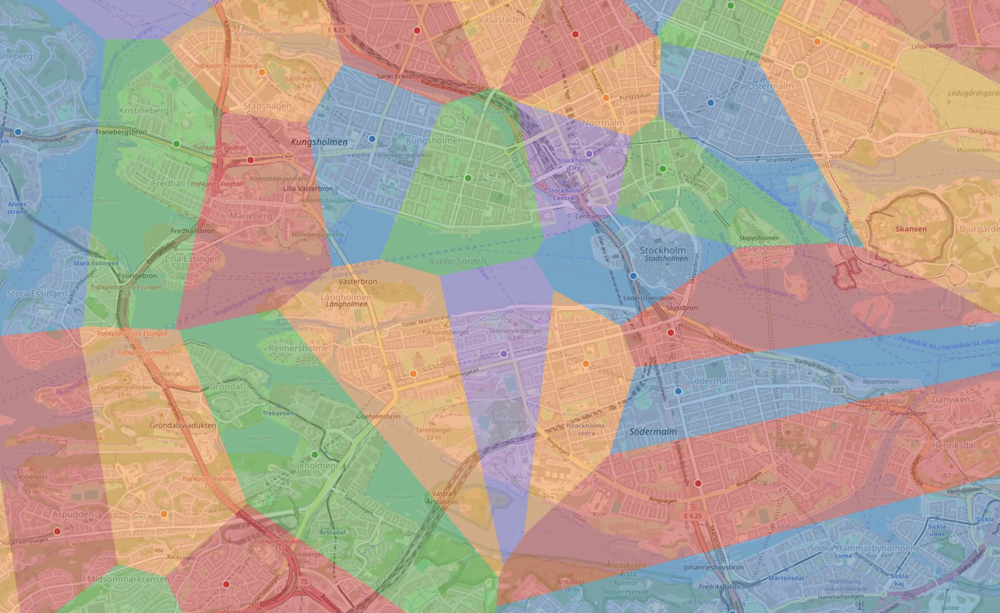

# voronoi-subway-map
Creates a colored Voronoi of the cloests subway station, overlaid with OpenStreetMaps of closest subway station selected on the map view.

The subway stations are the circumcenters of the Delaunay triangulation.

Each station gets colored and then the Voronoi cell are colored with the same color.

