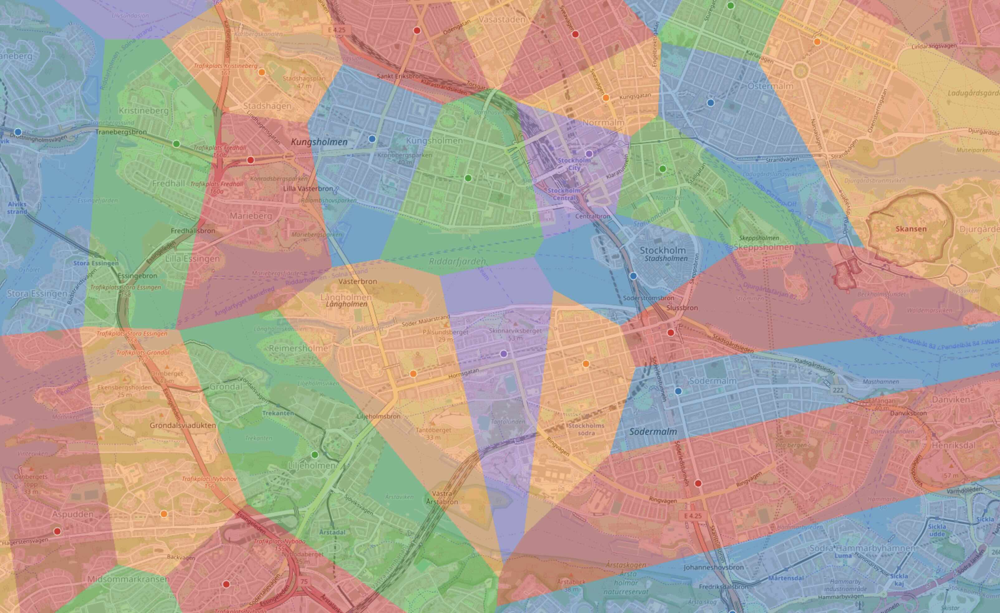

# Nearest Station Map

*How far is my station?*

Interactive map showing colored regions for transit stations worldwide. Each colored region represents the area closest to a particular station — hover anywhere to see which station you're nearest to and how far away it is.

**Try it live: [nearest-station.loessl.org](https://nearest-station.loessl.org/)**



## How it works

The map uses [Delaunay triangulation](https://en.wikipedia.org/wiki/Delaunay_triangulation) to connect all station points into a triangle mesh, then derives the [Voronoi diagram](https://en.wikipedia.org/wiki/Voronoi_diagram) — the dual structure where each cell contains all points closer to its station than to any other. The cells are filled as colored polygons on an HTML canvas overlay.

The same Delaunay structure powers the floating station label: `delaunay.find(x, y)` locates the nearest station for any cursor position in roughly O(1) time by walking the triangulation, so there's no need to hover precisely on a station dot.

## Features

- **Voronoi overlay** with toggleable cell borders on top of OpenStreetMap tiles
- **4 data modes**: Subways, All rail (light rail, monorail, tram), Airports, Buses
- **Floating station label** with haversine distance to nearest station
- **City search** via Nominatim geocoder
- **Explore dropdown** with curated cities showcasing interesting patterns
- **Dark mode** with CartoDB Dark Matter tiles
- **Copy link** to share your current view (lat/lon/zoom/mode preserved in URL)
- **Performance stats** overlay with per-phase timing breakdown
- **[Fun facts](https://nearest-station.loessl.org/fun-facts.html)** page with data insights and clickable points of interest

## Data

Station data comes from [OpenStreetMap](https://www.openstreetmap.org/) via the [Overpass API](https://overpass-api.de/). Subway, rail, and airport data is pre-fetched and served as static JSON files. Bus stops are queried live from the current viewport.

| Dataset | Stations | Source |
|---------|----------|--------|
| Subways | ~18,000 | Static, pre-fetched |
| All rail | ~85,000 | Static, pre-fetched |
| Airports | ~46,000 | Static, pre-fetched |
| Buses | Varies | Live Overpass query |

### Refreshing data

```sh
./scripts/fetch-stations.fish
```

Downloads data from Overpass in 10-degree longitude strips (36 per mode) with retry logic. Skips already-downloaded strips on rerun. The normalization step (`scripts/normalize.jq`) deduplicates same-name stations within 500m.

## Easter egg

There's a hidden developer mode. Try pressing `c` three times. Or add `?chris=1` to the URL.

## Tech stack

- [Leaflet](https://leafletjs.com/) 1.9.4 — map rendering
- [D3 Delaunay](https://github.com/d3/d3-delaunay) — Voronoi computation
- [leaflet-control-geocoder](https://github.com/perliedman/leaflet-control-geocoder) — city search
- No build tools, no framework — single `index.html` file

## License

[MIT](LICENSE)
